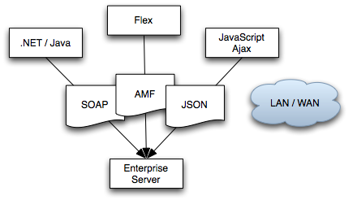
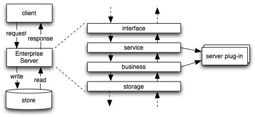

Enterprise Server 7 (and earlier versions) supports the SOAP protocol. Because this protocol has some performance- and integration disadvantages, Enterprise Server 8 supports two additional protocols (AMF and JSON) that can be used instead of SOAP.

## SDK documentation vs WSDL files

The SOAP protocol is defined in WSDL files. Even though the requests, responses and data structures sent between client and server are essentially the same as for AMF and JSON protocols (only wrapped differently), the WSDL files are designed for SOAP and therefore they are not suitable for validation of AMF and JSON. And, when developing a new AMF or JSON client, it would be odd to use WSDL files to find out how requests and responses should look like. Therefore, Enterprise Server 8 ships documentation that is independent of the protocol and does no longer require WSDL knowledge. For each interface (workflow, planning, admin, etc) there is an HTML page available containing full definition of all services and data structures. All definitions are hyperlinked to ease lookups. The documentation entry point can be found here:

*http://localhost/Enterprise/sdk/doc/interfaces/index.htm*

## Protocol choice

Besides performance, the ease of integration can be important too. For a JavaScript module running in web browser, it is hard to deal with SOAP due to lack of decent libraries. For a Flex client, SOAP is possible, but AMF is much more suitable. The figure below shows a bunch of programming languages with their most obvious choice.



See [Client Applications](client-applications.md) for more details about client applications integrating with Enterprise through specific protocols.

## Protocol abstraction

On the server side, it is the responsibility of the interface layer to support protocols (SOAP, AMF and JSON). This is done for all interfaces (workflow, planning, admin, etc). In the figure below, you can see the concept of a client talking to the server. In the middle, the architectural layers of the server are shown. On the very top, where client requests arrive and the server responses depart, the interface layer is positioned. This layer unwraps the protocol notation of incoming requests and creates PHP request objects and data classes that are passed through the service layer underneath. On the way back, it wraps a protocol structure around the PHP response classes and data classes taken from the service layer before it gets sent out to client.



On the far right of the figure, it shows that server plug-ins are called from service- and business layers. This shows that server plug-ins do not have to know about the protocols; this is taken care of by the server (at the interface layer).

## DIME and Transfer Server

The SOAP protocol is specified in the WSDL files. The workflow and planning WSDL files still specify DIME for some services, such as for the CreateObjects workflow service:
```xml
<operation name="CreateObjects">
	<soap:operation soapAction="urn:SmartConnection#CreateObjects"/>
	<input>
		<dime:message layout="http://schemas.xmlsoap.org/ws/2002/04/dime/closed-layout" wsdl:required="false"/>
		<soap:body use="literal"/>
	</input>
	<output>
		<soap:body use="literal"/>
	</output>
</operation>
```

This does not imply that DIME -has- to be used. Instead, the File Transfer Server can be used, as explained in next chapter. For DIME, the Content element of the file attachment is used. To send files through the File Transfer Server, the FileUrl element is used. No matter which of the two methods is used, the server plug-ins use the FilePath attribute of the Attachment object. (Same for PHP web/admin applications.) The WSDL files show that FilePath and FileUrl are introduced since v8 as an alternative for Content:
```xml
<complexType name="Attachment">
	<all>
		<element name="Rendition" type="tns:RenditionType"/>
		<element name="Type" type="xsd:string"/>
		<element name="Content" type="tns:AttachmentContent" ... />
		<element name="FilePath" type="xsd:string" ... />
		<element name="FileUrl" type="xsd:string" ... />
	</all>
</complexType>
```
For these three elements, there is always one in use while the other two are nullified.

## Migration of Enterprise 7 integrations

The impact of the introduction of the new protocols (AMF and JSON) to your Enterprise 7 integrations are discussed in this chapter.

### SOAP clients

There is no real need to migrate your SOAP clients to support the AMF or JSON protocols because there are no plans to drop the SOAP protocol. However, there are some reasons why you might want to consider AMF or JSON instead of SOAP:

**AMF**: Because AMF is significantly faster than SOAP, you might want to migrate your SOAP client to AMF for the sake of performance. It is possible to mix both protocols to ease migration processes. So you can simply start with one service doing AMF while the others are still doing SOAP.

**JSON**: Until today, there seems to be no mature SOAP library available for JavaScript (using Ajax). Building your integrations with Enterprise Server upon a shaky library could result into stability issues. A much better choice for this particular language is JSON.

If you need to upload or download files and you choose for AMF or JSON, you implicitly choose for the Transfer Server, since DIME is supported for SOAP only.

### Server Plug-ins

Note that Server Plug-ins do not have to deal with the new protocols at all. SOAP, AMF and JSON requests and responses travel through the very same service classes using the very same request-, response- and data classes. And, no matter which file transfer technique clients are using (DIME or Transfer Server) the Attachment data class will have the FilePath filled.
